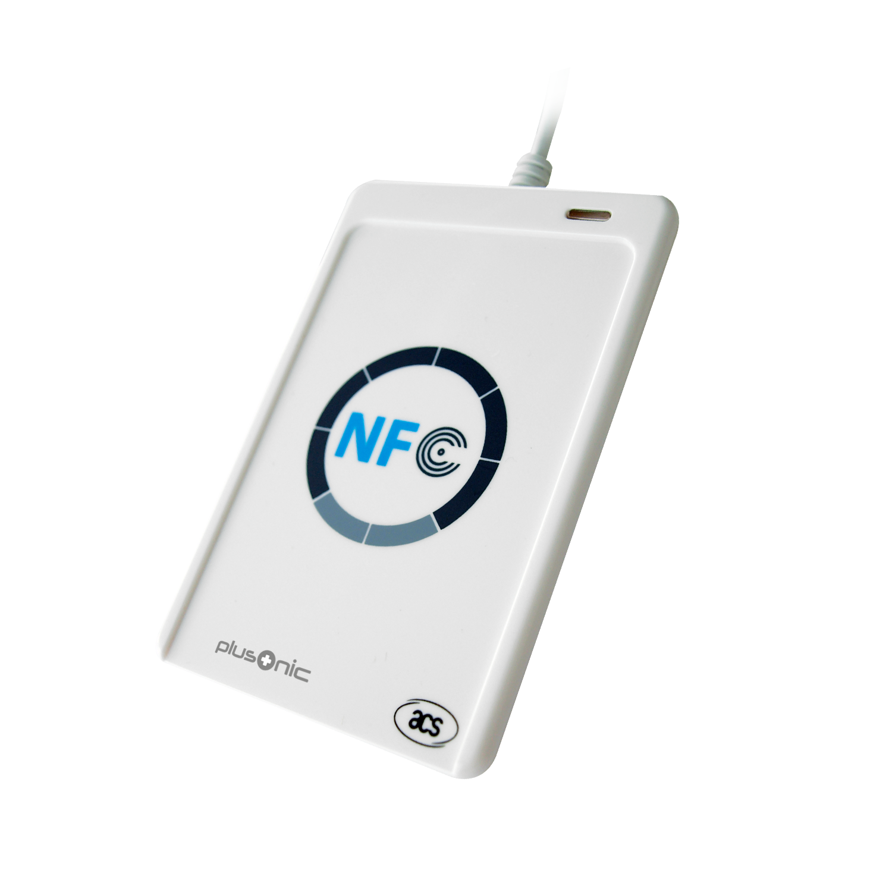

# NFC reader ACR122U

This repository hosts the Lazarus bindings for a [ACR122U](https://www.acs.com.hk/en/products/3/acr122u-usb-nfc-reader/) USB NFC Reader like this one: <br>

<br>

The readers datasheet can be downloaded [here](https://www.acs.com.hk/download-manual/419/API-ACR122U-2.04.pdf).

The source code of this repository was initially taken [here](http://www.infintuary.org/stpcsc.php).

The code then was modified to work with Lazarus 4.99 under Linux Mint and Windows 11.

## Installation

### Windows

The demos should run right out of the box, plug in the reader and run one of the two example applications.

### Linux
As the reader is sometimes beeing detected wrong use the [nfc_reader_healthcheck](scripts/nfc_reader_healthcheck.sh) script to detect the reader. Furthermore you can use the [Readme](scripts/Readme.md) to get the reader working first. 

When you see this output from the pcsc_scan tool you can run the example applications:

```
<user>@<machine>:~$ pcsc_scan
PC/SC device scanner
V 1.7.1 (c) 2001-2022, Ludovic Rousseau <ludovic.rousseau@free.fr>
Using reader plug'n play mechanism
Scanning present readers...
0: ACS ACR122U PICC Interface 00 00

Thu Apr 23 16:04:22 2026
 Reader 0: ACS ACR122U PICC Interface 00 00
  Event number: 0
 Card state: Card removed,
```
 